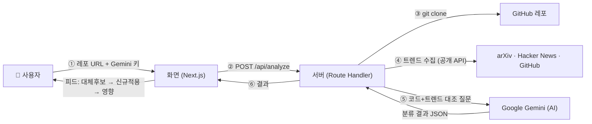
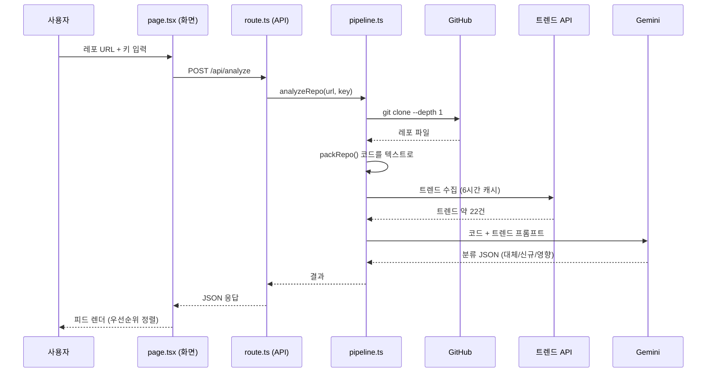
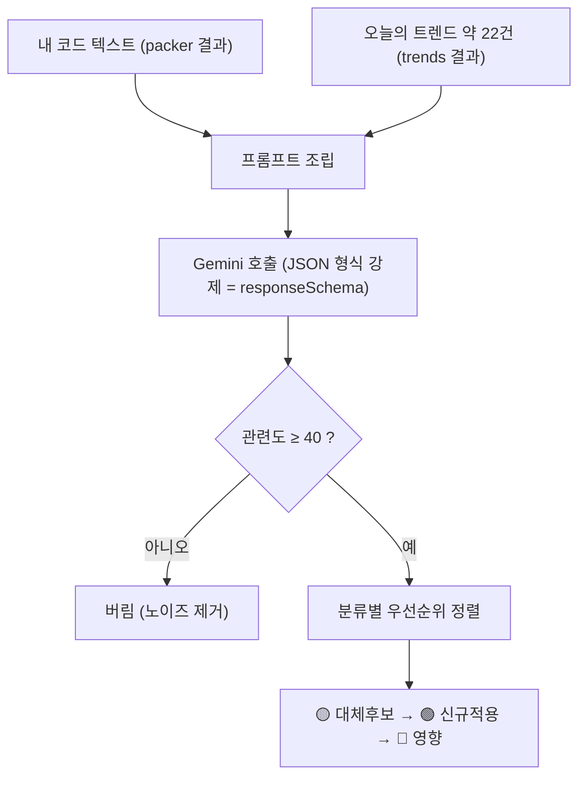
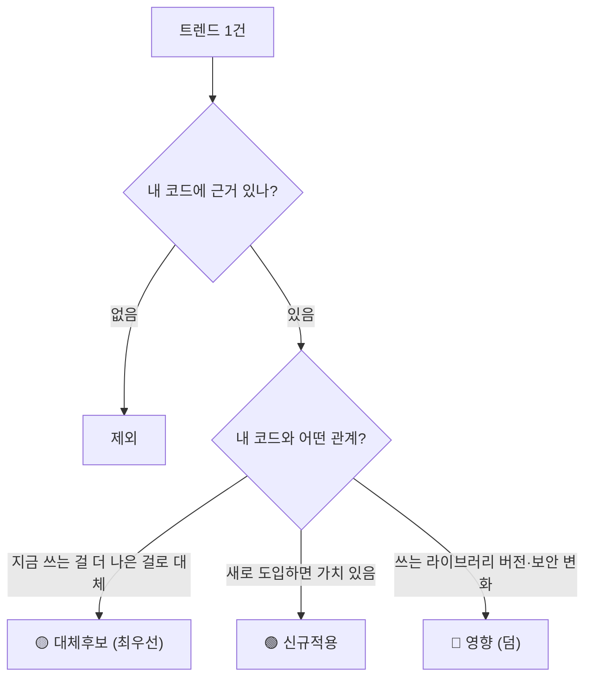

# CodePulse 개발 문서 (처음 보는 사람용)

> "내 GitHub 레포를 넣으면, 오늘 나온 AI 트렌드 중 **내 코드에 의미 있는 것만** 골라
> [대체후보]/[신규적용]/[영향]으로 분류해서 보여주는" 웹앱입니다.
> 이 문서는 **지금 실제로 돌아가는 코드**가 어떻게 작동하는지를 설명합니다.
> (기획서의 "예정" 기능 — 벡터DB·임베딩·코드위키 등 — 은 아직 미구현이며, "10. 아직 안 한 것"에 정리)

> 📌 노션용: 아래 `mermaid` 코드블록은 노션에서 자동으로 다이어그램으로 렌더링됩니다.

---

## 1. 한눈에 보기



핵심 한 줄: **"수집(API 크롤링) → 내 코드 이해(패킹) → AI에게 대조 질문(매칭) → 분류해서 피드"**

---

## 2. 기술 스택 (무엇으로 만들었나)

| 영역 | 사용 기술 | 왜 / 무슨 역할 |
|---|---|---|
| 화면(프론트) | **Next.js 15 (App Router) + React 19 + TypeScript** | 웹 페이지 + 버튼/입력 UI. TypeScript로 타입 안정성 |
| 스타일 | **Tailwind CSS v4** | 클래스로 빠르게 디자인 (다크 테마) |
| 서버(백엔드) | **Next.js Route Handler** (`app/api/analyze`) | 별도 서버 없이 Next 안에서 API 처리. **Node.js 런타임** |
| AI(두뇌) | **Google Gemini API** (`gemini-2.5-flash`) | 코드와 트렌드를 읽고 "의미"를 판단하는 핵심 |
| 레포 가져오기 | **git** (`git clone --depth 1`) | 사용자의 GitHub 레포를 임시 폴더로 복제 |
| 데이터 출처 | **arXiv / Hacker News / GitHub 공개 API** | 매일의 AI 트렌드 원천 |
| 임시 저장 | **로컬 JSON 파일** (`data/trends-cache.json`) | 트렌드를 6시간 캐시 (매번 다시 안 긁게) |

> 참고: 원래 기획은 백엔드를 Python(FastAPI)으로 했지만, 이 PC의 Python 환경 문제로 **전부 Node.js(JS/TS) 단일 스택**으로 만들었습니다. 서버 하나로 끝나서 더 단순합니다.

---

## 3. 전체 동작 흐름

모든 코드는 `codepulse-web/` 안에 있습니다. 요청 하나가 처리되는 과정:



### 파일별 역할
- **`app/page.tsx`** — 온보딩 화면. 레포 URL + 🔑 Gemini 키(브라우저 localStorage 저장) 입력 → `/api/analyze` 호출 → 진행 표시 → 결과를 Feed로 전환.
- **`app/api/analyze/route.ts`** — `POST` 진입점. `repoUrl`, `apiKey`를 꺼내 `analyzeRepo()` 호출, 에러 시 500 반환.
- **`lib/pipeline.ts`** — 지휘자. URL 검증 → `cloneRepo()` → `packRepo()` → `loadOrCollectTrends()` → `matchTrends()` → 임시폴더 삭제 → 결과 반환.
- **`components/Feed.tsx`** — 결과를 우선순위(대체후보→신규적용→영향)·관련도 순으로 정렬, 필터 탭·카드 표시.

---

## 4. 레포 분석 = "코드 패킹" — `lib/packer.ts`

AI는 폴더를 직접 못 봅니다. 그래서 **레포 전체를 하나의 긴 텍스트(Markdown)로 압축**해서 AI에게 줍니다.

하는 일:
1. 폴더를 전부 훑되 `node_modules`, `.git`, 이미지·동영상 같은 **불필요/바이너리 파일은 제외**.
2. **README + 의존성 파일(package.json, requirements.txt 등) + 소스코드**를 모음.
3. `package.json`/`requirements.txt`에서 **의존성 목록**을 뽑고, 키워드로 **스택 태그**를 추론
   (예: `torch` → `ML/DL`, `langchain·transformers` → `LLM`, `faiss·chromadb` → `RAG/VectorDB`).
4. 너무 길면 자름 — 파일 1개당 최대 16,000자, 전체 최대 300,000자.

결과물: "이 프로젝트가 무엇을 하고, 어떤 기술을 쓰는지"가 담긴 한 편의 텍스트 → 이게 AI 판단의 **근거(grounding)** 가 됩니다.

---

## 5. 트렌드 수집 = "API 크롤링" — `lib/trends.ts`

"크롤링"이라고 하지만 **HTML을 긁는 게 아니라 공개 API를 호출**합니다(합법·안정적). 3곳에서 가져옵니다:

| 출처 | 호출 방식 | 가져오는 것 | 개수 |
|---|---|---|---|
| **arXiv** | `export.arxiv.org/api/query` (HTTP GET) | 최신 AI 논문 (`cs.AI`/`cs.CL`/`cs.LG`, 최신 제출순) | 8 |
| **Hacker News** | `hn.algolia.com` 검색 API | 최근 7일 "AI" 관련 인기글 (포인트>20) | 7 |
| **GitHub** | `api.github.com/search/repositories` | 최근 활발+인기 레포 (`LLM pushed:>날짜 stars:>50`) | 7 |

- 각 항목은 통일된 모양(`Trend`)으로 변환: `{ id, source, title, url, signal, summary, category }`.
  - 예) arXiv 응답은 XML이라 정규식으로 제목·요약·링크를 파싱.
- 합쳐서 보통 **약 22건**. 이걸 `data/trends-cache.json`에 저장하고 **6시간 동안 재사용**(매 분석마다 다시 안 긁어서 빠르고, API 한도도 아낌).

> 트렌드는 "내 레포"와 무관하게 **세상 공통**으로 모읍니다. 개인화는 다음 단계(매칭)에서 일어납니다.

---

## 6. 핵심: 매칭 알고리즘 — `lib/matcher.ts`

여기가 CodePulse의 심장입니다. 한 줄 요약:

> **"전통적인 머신러닝 모델을 학습시킨 게 아니라, 잘 설계된 질문(프롬프트)으로 Gemini(LLM)에게 판단을 시키고, 그 답을 정해진 JSON 형식으로 받아서, 점수로 거르고 우선순위로 정렬한다."**



작동 단계:

**(1) 질문(프롬프트) 만들기** — `[내 코드 컨텍스트] + [트렌드 22건]`을 담고 규칙 부여:
- "내 코드와 **실제로 관련된 것만** 출력해라. 무관한 건 버려라(적게 보여주는 게 가치)."
- "**대체후보 > 신규적용 > 영향** 우선순위로 분석해라."
- "왜 중요한지는 반드시 **내 코드의 파일·기법**에 근거해라. 지어내지 마라."
- "각 항목에 **관련도 0~100점**을 매겨라."

**(2) 구조화된 답변 강제 (responseSchema)** — 자유 문장이 아니라 항상 이 JSON으로:
```json
{
  "trend_id": "T03",
  "classification": "대체후보",
  "relevance": 88,
  "why": "rag/retriever.py가 FAISS 단순 top-k라서…",
  "grounding": "rag/retriever.py, faiss",
  "next_action": "검색 단계를 리랭킹으로 교체: …",
  "url": "https://…"
}
```

**(3) 점수로 거르기** — `relevance < 40`(MIN_RELEVANCE)이면 버림 → 22건 중 노이즈가 빠지고 보통 몇 건만 남음.

**(4) 우선순위 정렬** (`components/Feed.tsx`) — `대체후보 → 신규적용 → 영향`, 같은 분류 안에서는 관련도 높은 순.

**(5) 429(사용량 초과) 자동 재시도** — 무료 키 한도에 걸리면 2초·4초 간격 최대 2회 재시도, 그래도 막히면 "잠시 후 재시도" 안내.

즉 "알고리즘"의 정체 = **LLM 추론 + 프롬프트 설계 + 구조화 출력 + 임계값 필터 + 우선순위 정렬**의 조합.
(현재는 임베딩/유사도 계산 없이 **전부 Gemini에게 직접** 줍니다. 임베딩·벡터DB는 미구현 — 10번 참고.)

---

## 7. 왜 [대체후보]/[신규적용]/[영향]으로 뜨는가

세 분류는 **Gemini가 프롬프트의 정의에 따라 직접 붙입니다.** 판단 흐름:



| 분류 | 정의 | 예시 |
|---|---|---|
| 🟡 **대체후보** (최우선) | 내가 **지금 쓰는 것**을 더 나은 새 기술로 **갈아끼우기** | "네 `retriever.py`의 단순 top-k 검색 → 새 리랭킹 기법으로 교체하면 정확도↑" |
| 🟢 **신규적용** | 아직 안 쓰지만 **새로 도입**하면 가치 있는 기법/도구 | "평가 자동화(LLM-as-judge)를 새로 붙이면 좋다" |
| 🔴 **영향** (덤) | 내가 쓰는 라이브러리의 **버전·보안·deprecation** 변화 | "쓰고 있는 `transformers`에 보안 패치/호환성 변경 발생" |

> 핵심 가치는 **🟡대체후보·🟢신규적용**(= 새 기술로 내 코드를 어떻게 발전시킬지).
> 🔴영향은 Dependabot 같은 도구도 하는 "덤"이라 피드 아래쪽에 배치.
> 판단 **근거(grounding)** 가 항상 "내 코드의 어떤 파일/기법"인 게 일반 뉴스레터와의 차이.

---

## 8. 파일 구조 한눈에

```
codepulse-web/
├─ app/
│  ├─ page.tsx              # 온보딩 화면 + 진행 표시 + 결과를 Feed로 전환
│  ├─ layout.tsx            # 공통 레이아웃(메타, 다크 테마)
│  ├─ globals.css           # Tailwind + 다크 배경
│  └─ api/analyze/route.ts  # POST /api/analyze 엔드포인트(백엔드 진입점)
├─ components/
│  └─ Feed.tsx              # 결과 피드 UI(정렬·필터·카드)
├─ lib/                     # ★ 실제 로직
│  ├─ pipeline.ts           # 전체 순서 지휘(clone→pack→trends→match)
│  ├─ packer.ts             # 레포 → 단일 텍스트(코드 패킹)
│  ├─ trends.ts             # arXiv/HN/GitHub 수집 + 캐시
│  ├─ matcher.ts            # Gemini 프롬프트 + 구조화 출력 + 재시도
│  └─ types.ts              # 공통 타입(Trend, Match 등)
├─ data/
│  ├─ trends-cache.json     # 트렌드 6시간 캐시
│  └─ matches.json          # 데모용 사전 분석 결과
└─ .env.local               # GEMINI_API_KEY, GEMINI_MODEL (키는 비워둠)
```

---

## 9. 실행 방법

```bash
cd codepulse-web
npm install          # 처음 1회
npm run dev          # http://localhost:3000
```
- 브라우저에서 레포 URL 입력 → 🔑 칸에 Gemini 키 입력(발급: https://aistudio.google.com/apikey).
- 키 없이 보고 싶으면 화면 하단 **"데모 결과 보기"**(번들된 사전 분석본).

---

## 10. 아직 안 한 것 (기획서엔 있지만 미구현)

지금 MVP는 "핵심 가설(코드↔트렌드 매칭)이 된다"를 증명한 단계입니다. 다음이 남아 있습니다:

- **임베딩 + 벡터DB(Chroma)**: 지금은 트렌드 전부를 Gemini에 통째로 줌. 트렌드가 많아지면 임베딩 유사도로 1차 후보를 좁히는 게 필요.
- **코드 위키(deepwiki-open) 연동**: 지금은 코드를 단순 텍스트로 패킹. 위키화하면 더 정밀한 근거 가능.
- **Q&A(RAG)**: 카드 안 "이게 왜 내 코드에?" 입력칸은 현재 비활성(예정).
- **자동화/푸시**: 매일 자동 수집 + 디스코드/메일 알림.
- **평가 지표 측정**: 분류 정확도·환각률 등 정량 검증.

---

### 한 줄 정리
**공개 API로 트렌드를 모으고(crawling) → 내 레포를 텍스트로 압축해(packing) → 둘을 Gemini에게 같이 주며 "내 코드 기준으로 분류·근거·다음행동을 JSON으로 답해"라고 시키고(matching) → 점수로 거르고 우선순위로 정렬해 피드로 보여준다.**
